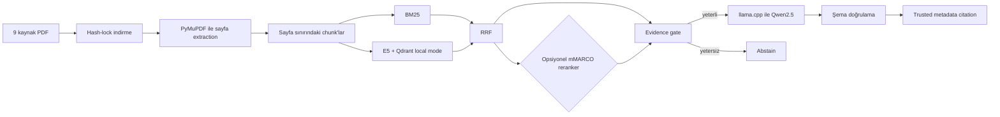

# Turkish Local RAG Benchmark

English · [Türkçe](README.tr.md)

This project is a reproducible, CPU-only retrieval-augmented generation benchmark built around nine real Sabancı University regulation PDFs. It brings together page-aware extraction, BM25, multilingual E5, reciprocal-rank fusion (RRF), optional cross-encoder reranking, a deterministic evidence gate, local Qwen2.5 generation, and a citation layer built solely from trusted corpus metadata.

My goal was to build a small research/portfolio project that could be measured from end to end. For that reason, the project should not be treated as an advisory system for legal, academic, student affairs, or university policy matters. Source documents may change or be removed over time, and generated answers may be incomplete or incorrect. The current official document should always be checked separately.

## Architecture



The target system is a Windows environment with an Intel i5-12450H, 8 GB of RAM, and CPU-only execution. It does not require CUDA, paid APIs, cloud LLMs, Docker, or a separate Qdrant server.

## What is included in the repository

- `data/manifest.json`: Source IDs, titles, source pages, and PDF URLs
- `data/corpus.lock.json`: The verified final URL, UTC download time, exact byte size, and SHA-256 value for each of the nine PDFs
- Code, configuration, network-free tests, silver evaluation data, provenance information, and reports

The PDFs are not committed to the repository because they are third-party source files that may be updated or removed over time. PDF bytes and local metadata are ignored under `data/pdfs/` and `data/downloads/`. Models, runtime binaries, extraction/chunk artifacts, the Qdrant index, and caches are likewise kept outside the repository. The lock manifest makes it possible to keep the corpus identity fixed without redistributing the PDFs.

## Installation

Python 3.12 or newer is required.

```powershell
git clone <repository-url>
cd turkish-local-rag-benchmark

python -m venv .venv
.\.venv\Scripts\python.exe -m pip install --upgrade pip
.\.venv\Scripts\python.exe -m pip install -e ".[dev]"
.\.venv\Scripts\python.exe -m pytest -q
```

An internet connection is required to install the dependencies. The unit tests use fixtures and mocks, so they do not download PDFs or models or make network calls.

## Reproducing the corpus and index

First, download the nine PDFs and verify that they match the lock file in the repository exactly:

```powershell
.\.venv\Scripts\python.exe -m turkish_local_rag.download --config config\default.toml
.\.venv\Scripts\python.exe -m turkish_local_rag.corpus_lock --config config\default.toml --verify
```

The downloader first streams the content to a temporary file. Once the HTTP, PDF signature/trailer, size, and hash checks are complete, it moves the file atomically. It does not silently overwrite an existing different file or remote content that differs from the lock. If the official source has genuinely changed, it needs to be reviewed as a new corpus version; the lock file is not updated automatically.

Extraction and chunking steps:

```powershell
.\.venv\Scripts\python.exe -m turkish_local_rag.extract --config config\default.toml
.\.venv\Scripts\python.exe -m turkish_local_rag.chunk --config config\default.toml
```

The real checkpoint contains 69 physical PDF pages, 68 extracted text-page rows, and 436 chunks. No chunk crosses a physical page boundary. The raw text is preserved alongside the normalized text.

The corpus-specific `ılgili` → `İlgili` correction is applied only to seven proven whole-word locations; it is not a general dotless `ı` conversion. The real E5 token counts are 18 / 139,81 / 289 for min/mean/max. In other words, no chunk exceeds the 512-token limit.

To download the pinned embedding and reranker assets and build the local index:

```powershell
.\.venv\Scripts\python.exe -m turkish_local_rag.index --config config\default.toml --download-model-only
.\.venv\Scripts\python.exe -m turkish_local_rag.index --config config\default.toml --download-reranker-only
.\.venv\Scripts\python.exe -m turkish_local_rag.index --config config\default.toml
```

An existing collection is changed only when `--rebuild` is explicitly provided. The checkpoint contains 436 normalized 384-dimensional vectors, the logical fingerprint `ed36a52e3d0d39d2aee348e4d19c4834a25b6a023b367ce2a8bcd9f9a0c44566`, and an on-disk size of 2.495.132 bytes. The measured rebuild time is 40,43 seconds, with a peak process working set of about 926 MiB.

## Setting up and verifying the local generator

The project uses a single generator:

- Repository: `Qwen/Qwen2.5-1.5B-Instruct-GGUF`
- Revision: `91cad51170dc346986eccefdc2dd33a9da36ead9`
- File/quantization: `qwen2.5-1.5b-instruct-q4_k_m.gguf`, `Q4_K_M`
- Size: 1.117.320.736 bytes
- SHA-256: `6a1a2eb6d15622bf3c96857206351ba97e1af16c30d7a74ee38970e434e9407e`
- License: Apache-2.0

The runtime is `llama.cpp` b10621 (`0.3.0-dev`, commit `c1d0e7a00`) Windows CPU x64. The archive size is 18.068.018 bytes, and its SHA-256 value is `0e8b65e650e369f70f8307d890508886f171ef4fb00facccddd4a1b7ffdaca51`.

```powershell
# Var olan asset'leri internet kullanmadan tam boyut/hash ile doğrular
.\.venv\Scripts\python.exe -m turkish_local_rag.setup_generation --config config\default.toml --verify

# Temiz clone'da yalnızca sabit ~1,12 GB GGUF ve ~18 MB runtime indirilir
.\.venv\Scripts\python.exe -m turkish_local_rag.setup_generation --config config\default.toml --download
```

The setup tool verifies the HTTPS redirect host, exact file size, and SHA-256 value. It uses a temporary file and an atomic move during downloads; it skips an existing verified asset and refuses to overwrite a mismatched file.

The generator uses a persistent `llama-server`, a 2.560-token context, at most 160 output tokens, seed 42, temperature 0, and four CPU threads. More details are available in the [generator protocol lock](docs/generator_protocol.md).

## Querying

`hybrid_rrf` is the fast default pipeline. `hybrid_reranked` is the optional comparison mode:

```powershell
.\.venv\Scripts\python.exe -m turkish_local_rag.query --question "Sabancı Üniversitesinin en yüksek karar organı hangisidir?" --pipeline hybrid_rrf

.\.venv\Scripts\python.exe -m turkish_local_rag.query --question "Sabancı Üniversitesinin en yüksek karar organı hangisidir?" --pipeline hybrid_reranked
```

The evidence gate can abstain before calling the model when there is not enough evidence. The model output is parsed and schema-validated; the system fails closed if the output is invalid.

Citation information is not taken from model-written text. It is built from retrieved `document_id`, title, physical page, source URL, PDF URL, and `chunk_id` metadata. Successful answers and abstention results use the same versioned JSON schema 1.1; retrieval, reranking, generation, and total latency values are stored in separate fields.

## Evaluation methodology and provenance

The benchmark uses an AI-assisted silver evaluation set. Its release and use were approved by the project owner after automated grounding checks and a human audit of 20 out of 50 records. The complete dataset was not reviewed item by item and is not presented as a human-reviewed gold set.

```text
kind=silver
creation_method=ai_assisted
dataset_release_approved=true
approved_by=berksankir
approval_scope=dataset_level_with_sample_audit
all_records_human_reviewed=false
audit=20/50 (20 approved)
final_gold=false
```

The legacy `human_reviewed=false` field only means that all 50 records were not reviewed at the item level; it does not invalidate the dataset-level release approval. The 20 actual item-level decisions are in `evaluation/silver_audit.csv`. No reviewer or timestamp was generated for the remaining 30 records. The test split was not used to select the model, prompt, pipeline, or threshold. LLM-as-a-judge is not used either.

```powershell
.\.venv\Scripts\python.exe -m turkish_local_rag.review --config config\default.toml validate-silver-audit
.\.venv\Scripts\python.exe -m turkish_local_rag.evaluate --config config\default.toml --dataset silver
.\.venv\Scripts\python.exe -m turkish_local_rag.evaluate_generation --config config\default.toml
```

Existing reports are not changed unless `--overwrite` is explicitly provided. The original Phase 8 generation run is preserved under `evaluation/results/silver/phase8_baseline/`.

## Real benchmark results

Retrieval-only results, 40 answerable records:

| Pipeline | R@1 | R@3 | R@5 | MRR | Document@1 | Page@1 | Ortalama latency |
|---|---:|---:|---:|---:|---:|---:|---:|
| Dense | 0,550 | 0,875 | 0,925 | 0,714 | 0,800 | 0,550 | 86,8 ms |
| BM25 | 0,675 | 0,900 | 0,950 | 0,799 | 0,875 | 0,675 | 3,2 ms |
| Hybrid RRF | 0,725 | 0,925 | 0,950 | 0,833 | 0,900 | 0,725 | 88,8 ms |
| Hybrid reranked | 0,775 | 0,950 | 1,000 | 0,868 | 0,925 | 0,775 | 4.467,5 ms |

Grounded generation results, 50 records:

| Pipeline | Citation accuracy | Answerable coverage | Correct abstention | False abstention | Token F1 | Key facts |
|---|---:|---:|---:|---:|---:|---:|
| Hybrid RRF | 0,676 | 0,925 | 0,700 | 0,075 | 0,420 | 0,390 |
| Hybrid reranked | 0,686 | 0,875 | 0,500 | 0,125 | 0,406 | 0,397 |

| Pipeline | Retrieval ort./p95 | Reranking ort./p95 | Generation ort./p95 | Total ort./p95 |
|---|---:|---:|---:|---:|
| Hybrid RRF | 60,5 / 99,8 ms | 0 / 0 ms | 15,26 / 30,12 sn | 15,33 / 30,18 sn |
| Hybrid reranked | 50,7 / 67,8 ms | 1,59 / 2,20 sn | 6,33 / 17,88 sn | 8,14 / 19,70 sn |

Because the pipelines ran one after the other, the difference in generation latency also reflects response length and cache warmth. In other words, the difference does not mean the reranker provides a direct speedup.

The real Phase 10 run took 1.173,2 seconds. Peak process-tree RSS was measured at approximately 2.928.771.072 bytes (2,73 GiB). Ten outputs failed closed: seven had invalid JSON syntax, and three had an invalid context ID. Quality metrics were unchanged from the Phase 8 baseline. See the [final error analysis](docs/error_analysis.md) for details.

## Real examples

Successful RRF query (`candidate-001`):

```json
{
  "question": "Sabancı Üniversitesinin en yüksek karar organı hangisidir?",
  "answer": "Mütevelli Heyet",
  "abstained": false,
  "citation": {
    "document_id": "sabanci-ana-yonetmeligi",
    "physical_page": 2,
    "chunk_id": "sabanci-ana-yonetmeligi:p2:c5"
  }
}
```

Correct abstention (`candidate-041`): The question “Sabancı Üniversitesi kampüs yemekhanesinin 7 Eylül 2026 Pazartesi günü öğle menüsü nedir?” produced “Yeterli kanıt bulunamadı.” with an empty citation list, without calling the model, because of `query_coverage_below_threshold`.

Real failure (`candidate-004`, RRF): The evidence reached the generator, but the model selected an untrusted context ID on both permitted attempts. The response failed closed with `generator_invalid_context_id`, and no citation was produced.

## Component versions and licenses

| Bileşen | Sabit sürüm/revision | Upstream lisans |
|---|---|---|
| Bu repository | 0.1.0 | [MIT](LICENSE) |
| Qwen2.5 generator | `91cad511…`, Q4_K_M | [Apache-2.0](https://huggingface.co/Qwen/Qwen2.5-1.5B-Instruct-GGUF/blob/main/LICENSE) |
| llama.cpp | b10621 / commit `c1d0e7a00` | [MIT](https://github.com/ggml-org/llama.cpp/blob/b10621/LICENSE) |
| multilingual-e5-small | `614241f6…` | [MIT](https://huggingface.co/intfloat/multilingual-e5-small/tree/614241f622f53c4eeff9890bdc4f31cfecc418b3) |
| mMARCO reranker | `1427fd65…` | [Apache-2.0](https://huggingface.co/cross-encoder/mmarco-mMiniLMv2-L12-H384-v1) |
| Qdrant client | 1.19.0 | [Apache-2.0](https://github.com/qdrant/qdrant-client/blob/master/LICENSE) |
| Sentence Transformers | 6.0.1 | [Apache-2.0](https://github.com/huggingface/sentence-transformers/blob/master/LICENSE) |
| PyMuPDF | 1.28.2 | [AGPL-3.0 veya ticari Artifex lisansı](https://pymupdf.readthedocs.io/en/latest/about.html#license-and-copyright) |
| rank-bm25 | 0.2.2 | [Apache-2.0](https://github.com/dorianbrown/rank_bm25/blob/master/LICENSE) |

This table is for informational purposes only; it is not legal advice or a compatibility guarantee. If the project is distributed, PyMuPDF's AGPL obligations or commercial license terms should be evaluated separately. Transitive dependencies have their own licenses as well.

The source code in this repository is released under the [MIT License](LICENSE). The project license does not replace or override third-party license obligations.

## Known limitations

- Nine PDFs and 50 silver questions are a small dataset for making broad generalizations.
- Only 20/50 records received an item-level human audit.
- Official URLs and content may change or be removed. The lock detects these changes but cannot preserve upstream availability.
- PyMuPDF text-layer extraction is not OCR; the text layer of one physical page is empty.
- The reranker is used zero-shot for Turkish in this project. While it improves some retrieval metrics, it worsens abstention results and adds CPU latency.
- Although citation metadata is trusted, strict citation relevance is about 68%.
- Token F1 (~0,42/0,41) and key-fact coverage (~0,39/0,40) are low.
- 10% of generation runs abstain because of schema/context validation.
- CPU generation time can range from a few seconds to more than 30 seconds per model call.
- The evidence threshold comes only from the small silver dev split; no test split tuning was performed.

Detailed artifacts are available under `evaluation/results/silver/`, while historical provisional results are under `evaluation/provisional/`.
