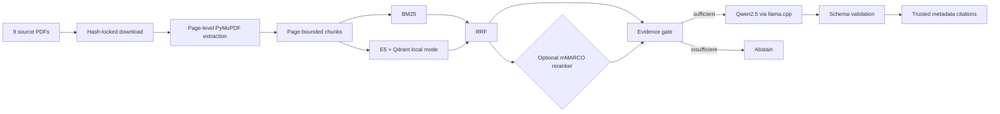

# Turkish Local RAG Benchmark

[Türkçe](README.tr.md) · English

A reproducible, CPU-only retrieval-augmented generation project over nine real
Turkish Sabancı University regulation PDFs. It combines page-aware extraction,
BM25, multilingual E5, reciprocal-rank fusion (RRF), optional cross-encoder
reranking, a deterministic evidence gate, local Qwen2.5 generation, and citations
built only from trusted corpus metadata.

This is a small research/portfolio benchmark, not a legal, academic, admissions,
or university-policy advisory system. Source documents may change or disappear,
and generated answers can be incomplete or wrong. Always consult the current
official document.

## Architecture



Target machine: Windows, Intel i5-12450H, 8 GB RAM, CPU only. CUDA, paid APIs,
cloud LLMs, Docker, and a Qdrant server are not required.

## What is committed

- `data/manifest.json`: source IDs, titles, source pages, and PDF URLs.
- `data/corpus.lock.json`: the verified final URL, UTC download time, exact byte
  size, and SHA-256 for each of the nine PDFs.
- Source code, config, networkless tests, silver evaluation data, provenance, and
  benchmark reports.

PDFs are not committed because they are third-party source files that can be
updated or withdrawn. PDF bytes and local download metadata stay under ignored
`data/pdfs/` and `data/downloads/`. Models, runtime binaries, extracted pages,
chunks, Qdrant indexes, and caches are also ignored. The lock manifest preserves
corpus identity without redistributing the PDFs.

## Installation

Python 3.12 or newer is required.

```powershell
git clone <repository-url>
cd turkish-local-rag-benchmark
python -m venv .venv
.\.venv\Scripts\python.exe -m pip install --upgrade pip
.\.venv\Scripts\python.exe -m pip install -e ".[dev]"
.\.venv\Scripts\python.exe -m pytest -q
```

The dependency install requires internet access. Unit tests use fixtures and
mocks; they do not download PDFs or models and do not call the network.

## Reproduce the corpus and index

Download the nine PDFs and require an exact match with the committed lock:

```powershell
.\.venv\Scripts\python.exe -m turkish_local_rag.download --config config\default.toml
.\.venv\Scripts\python.exe -m turkish_local_rag.corpus_lock --config config\default.toml --verify
```

Downloads are streamed to a temporary file, validated as PDF, hashed, and moved
atomically. An existing different file or a response that differs from the lock
is never overwritten. If an official source has legitimately changed, review it
as a new corpus version; do not silently update the lock.

Then extract and chunk:

```powershell
.\.venv\Scripts\python.exe -m turkish_local_rag.extract --config config\default.toml
.\.venv\Scripts\python.exe -m turkish_local_rag.chunk --config config\default.toml
```

The real checkpoint contains 69 physical PDF pages, 68 extracted text-page rows,
and 436 chunks. No chunk crosses a physical page. Raw source text is retained next
to normalized text. The corpus-specific `ılgili` → `İlgili` repair applies only to
seven proven whole-word locations; it is not a general dotless-`ı` replacement.
Real E5 token counts are min/mean/max 18 / 139.81 / 289, with no chunk above 512.

Install only the pinned embedding and reranker assets, then build the local index:

```powershell
.\.venv\Scripts\python.exe -m turkish_local_rag.index --config config\default.toml --download-model-only
.\.venv\Scripts\python.exe -m turkish_local_rag.index --config config\default.toml --download-reranker-only
.\.venv\Scripts\python.exe -m turkish_local_rag.index --config config\default.toml
```

Use `--rebuild` only to explicitly replace an existing collection. The checkpoint
has 436 normalized 384-dimensional vectors, logical fingerprint
`ed36a52e3d0d39d2aee348e4d19c4834a25b6a023b367ce2a8bcd9f9a0c44566`, and an
on-disk size of 2,495,132 bytes. The measured rebuild took 40.43 s and peaked at
about 926 MiB process working set on the target machine.

## Install or verify local generation

The single selected generator is:

- Repository: `Qwen/Qwen2.5-1.5B-Instruct-GGUF`
- Revision: `91cad51170dc346986eccefdc2dd33a9da36ead9`
- File/quantization: `qwen2.5-1.5b-instruct-q4_k_m.gguf`, `Q4_K_M`
- Size: 1,117,320,736 bytes
- SHA-256: `6a1a2eb6d15622bf3c96857206351ba97e1af16c30d7a74ee38970e434e9407e`
- License: Apache-2.0

Runtime: `llama.cpp` b10621 (`0.3.0-dev`, commit `c1d0e7a00`) Windows CPU x64;
archive size 18,068,018 bytes, SHA-256
`0e8b65e650e369f70f8307d890508886f171ef4fb00facccddd4a1b7ffdaca51`.

```powershell
# Existing assets: no network, full size/hash verification
.\.venv\Scripts\python.exe -m turkish_local_rag.setup_generation --config config\default.toml --verify

# Clean clone: downloads only the pinned ~1.12 GB GGUF and ~18 MB runtime
.\.venv\Scripts\python.exe -m turkish_local_rag.setup_generation --config config\default.toml --download
```

The installer validates HTTPS redirect hosts, exact sizes, and SHA-256 values,
uses temporary files plus atomic moves, skips already verified assets, and refuses
to overwrite mismatches. The generator uses a persistent `llama-server`, a
2,560-token context, at most 160 output tokens, seed 42, temperature 0, and four
CPU threads. See [generator protocol lock](docs/generator_protocol.md).

## Query

`hybrid_rrf` is the fast default. `hybrid_reranked` is an optional comparison mode:

```powershell
.\.venv\Scripts\python.exe -m turkish_local_rag.query --question "Sabancı Üniversitesinin en yüksek karar organı hangisidir?" --pipeline hybrid_rrf
.\.venv\Scripts\python.exe -m turkish_local_rag.query --question "Sabancı Üniversitesinin en yüksek karar organı hangisidir?" --pipeline hybrid_reranked
```

The evidence gate can abstain before calling the model. Model output is parsed and
validated; invalid output fails closed. Citations are never accepted from model
text—they are constructed from retrieved `document_id`, title, physical page,
source URL, PDF URL, and `chunk_id` metadata. Successful and abstained responses
share versioned JSON schema 1.1 and separate retrieval, reranking, generation, and
total latency.

## Evaluation methodology and provenance

The benchmark uses an AI-assisted silver evaluation set. Its release and use were
approved by the project owner after automated grounding checks and a human audit
of 20 out of 50 records. The complete dataset was not reviewed item by item and is
not presented as a human-reviewed gold set.

Machine-readable provenance is preserved across JSON, CSV, and Markdown:

```text
kind=silver
creation_method=ai_assisted
dataset_release_approved=true
approved_by=berksankir
approval_scope=dataset_level_with_sample_audit
all_records_human_reviewed=false
audit=20/50 (20 approved)
final_gold=false
```

Legacy `human_reviewed=false` means only that all 50 records were not individually
reviewed; it does not negate dataset-level release approval. The 20 actual
item-level decisions remain in `evaluation/silver_audit.csv`; no reviewer or
timestamp is invented for the other 30 records. Test data was not used to select
the model, prompt, pipeline, or evidence thresholds. No LLM-as-a-judge is used.

```powershell
.\.venv\Scripts\python.exe -m turkish_local_rag.review --config config\default.toml validate-silver-audit
.\.venv\Scripts\python.exe -m turkish_local_rag.evaluate --config config\default.toml --dataset silver
.\.venv\Scripts\python.exe -m turkish_local_rag.evaluate_generation --config config\default.toml
```

Existing results are protected unless `--overwrite` is explicit. The original
Phase 8 generation run is preserved under
`evaluation/results/silver/phase8_baseline/`.

## Real benchmark results

Retrieval-only, all 40 answerable records:

| Pipeline | R@1 | R@3 | R@5 | MRR | Document@1 | Page@1 | Mean latency |
|---|---:|---:|---:|---:|---:|---:|---:|
| Dense | 0.550 | 0.875 | 0.925 | 0.714 | 0.800 | 0.550 | 86.8 ms |
| BM25 | 0.675 | 0.900 | 0.950 | 0.799 | 0.875 | 0.675 | 3.2 ms |
| Hybrid RRF | 0.725 | 0.925 | 0.950 | 0.833 | 0.900 | 0.725 | 88.8 ms |
| Hybrid reranked | 0.775 | 0.950 | 1.000 | 0.868 | 0.925 | 0.775 | 4,467.5 ms |

Grounded generation, all 50 records:

| Pipeline | Citation accuracy | Answerable coverage | Correct abstention | False abstention | Token F1 | Key facts |
|---|---:|---:|---:|---:|---:|---:|
| Hybrid RRF | 0.676 | 0.925 | 0.700 | 0.075 | 0.420 | 0.390 |
| Hybrid reranked | 0.686 | 0.875 | 0.500 | 0.125 | 0.406 | 0.397 |

| Pipeline | Retrieval mean/p95 | Reranking mean/p95 | Generation mean/p95 | Total mean/p95 |
|---|---:|---:|---:|---:|
| Hybrid RRF | 60.5 / 99.8 ms | 0 / 0 ms | 15.26 / 30.12 s | 15.33 / 30.18 s |
| Hybrid reranked | 50.7 / 67.8 ms | 1.59 / 2.20 s | 6.33 / 17.88 s | 8.14 / 19.70 s |

The pipelines ran sequentially, so generation latency differences also reflect
response length and cache warmth; they are not a causal reranker speedup. The real
Phase 10 run took 1,173.2 s and measured approximate peak process-tree RSS of
2,928,771,072 bytes (2.73 GiB). Ten outputs failed closed: seven invalid JSON
syntax and three invalid context IDs. Quality metrics are unchanged from the
Phase 8 baseline. See the [full error analysis](docs/error_analysis.md).

## Real examples

Successful RRF query (`candidate-001`):

```json
{
  "question": "Sabancı Üniversitesinin en yüksek karar organı hangisidir?",
  "answer": "Mütevelli Heyet",
  "abstained": false,
  "citation": {
    "document_id": "sabanci-ana-yonetmeligi",
    "physical_page": 2,
    "chunk_id": "sabanci-ana-yonetmeligi:p2:c5"
  }
}
```

Correct abstention (`candidate-041`):

```json
{
  "question": "Sabancı Üniversitesi kampüs yemekhanesinin 7 Eylül 2026 Pazartesi günü öğle menüsü nedir?",
  "answer": "Yeterli kanıt bulunamadı.",
  "abstained": true,
  "abstention_reason": "query_coverage_below_threshold",
  "citations": []
}
```

Real failure (`candidate-004`, RRF): sufficient evidence reached the generator,
but it still selected an untrusted context ID after both allowed attempts. The response failed closed as
`generator_invalid_context_id`, returned no citation, and was not counted as a
normal answer.

## Component versions and licenses

| Component | Pinned version/revision | Upstream license |
|---|---|---|
| Qwen2.5 generator | `91cad511…`, Q4_K_M | [Apache-2.0](https://huggingface.co/Qwen/Qwen2.5-1.5B-Instruct-GGUF/blob/main/LICENSE) |
| llama.cpp | b10621 / commit `c1d0e7a00` | [MIT](https://github.com/ggml-org/llama.cpp/blob/b10621/LICENSE) |
| multilingual-e5-small | `614241f6…` | [MIT](https://huggingface.co/intfloat/multilingual-e5-small/tree/614241f622f53c4eeff9890bdc4f31cfecc418b3) |
| mMARCO reranker | `1427fd65…` | [Apache-2.0](https://huggingface.co/cross-encoder/mmarco-mMiniLMv2-L12-H384-v1) |
| Qdrant client | 1.19.0 | [Apache-2.0](https://github.com/qdrant/qdrant-client/blob/master/LICENSE) |
| Sentence Transformers | 6.0.1 | [Apache-2.0](https://github.com/huggingface/sentence-transformers/blob/master/LICENSE) |
| PyMuPDF | 1.28.2 | [AGPL-3.0 or commercial Artifex license](https://pymupdf.readthedocs.io/en/latest/about.html#license-and-copyright) |
| rank-bm25 | 0.2.2 | [Apache-2.0](https://github.com/dorianbrown/rank_bm25/blob/master/LICENSE) |

This table is informational, not legal advice or a compatibility guarantee.
PyMuPDF's AGPL obligations or commercial terms require particular attention for
distribution. Transitive dependencies have their own licenses. This repository's
own license has deliberately not been selected yet; third-party licenses do not
license the project code.

## Known limitations

- Nine PDFs and 50 silver questions are too small for broad claims.
- Only 20/50 evaluation records received item-level human audit.
- Official PDF URLs and contents can change or disappear; the lock detects change
  but cannot preserve upstream availability.
- PyMuPDF text-layer extraction is not OCR and one physical page is empty.
- Reranking is zero-shot for Turkish in this project and worsens abstention despite
  improving several retrieval metrics.
- Citation metadata is trustworthy, but strict citation relevance is only about
  68%.
- Token F1 (~0.42/0.41) and key-fact coverage (~0.39/0.40) are low.
- Ten percent of generation runs fail schema/context validation and abstain.
- CPU generation can take a few seconds to more than 30 seconds per model call.
- Evidence thresholds came only from the small silver dev split; no test-split
  tuning was performed.

Detailed artifacts live in `evaluation/results/silver/`, and historical
provisional outputs remain under `evaluation/provisional/`.
