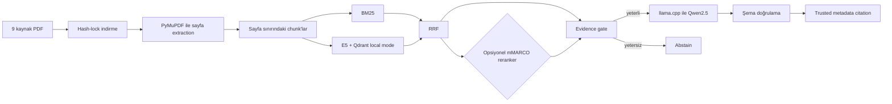

# Turkish Local RAG Benchmark

Türkçe · [English](README.md)

Dokuz gerçek Sabancı Üniversitesi yönetmelik PDF’i üzerinde çalışan, yeniden
üretilebilir ve CPU-only bir retrieval-augmented generation projesidir. Sayfa
duyarlı extraction, BM25, multilingual E5, reciprocal-rank fusion (RRF), opsiyonel
cross-encoder reranking, deterministik evidence gate, yerel Qwen2.5 generation ve
yalnız trusted corpus metadata’sından üretilen citation katmanlarını birleştirir.

Bu küçük bir araştırma/portföy benchmarkıdır; hukuki, akademik, öğrenci işleri veya
üniversite politikası danışmanlık sistemi değildir. Kaynak belgeler değişebilir ya
da kaldırılabilir; üretilen yanıtlar eksik veya yanlış olabilir. Güncel resmî belge
daima ayrıca kontrol edilmelidir.

## Mimari



Hedef sistem Windows, Intel i5-12450H, 8 GB RAM ve CPU-only’dir. CUDA, ücretli
API, cloud LLM, Docker veya Qdrant server gerekmez.

## Repository’de tutulanlar

- `data/manifest.json`: kaynak kimlikleri, başlıklar, kaynak sayfalar ve PDF URL’leri.
- `data/corpus.lock.json`: dokuz PDF’in doğrulanmış final URL’si, UTC indirme zamanı,
  tam byte boyutu ve SHA-256 değeri.
- Kod, config, networksüz testler, silver evaluation verisi, provenance ve raporlar.

PDF’ler üçüncü taraf kaynak dosyalar olduğu ve güncellenip kaldırılabildiği için
commit edilmez. PDF byte’ları ve yerel metadata `data/pdfs/` ile `data/downloads/`
altında ignore edilir. Modeller, runtime binary’leri, extraction/chunk artifact’ları,
Qdrant indexi ve cache’ler de ignore kapsamındadır. Lock manifesti PDF’leri yeniden
dağıtmadan corpus kimliğini sabitler.

## Kurulum

Python 3.12 veya üstü gerekir.

```powershell
git clone <repository-url>
cd turkish-local-rag-benchmark
python -m venv .venv
.\.venv\Scripts\python.exe -m pip install --upgrade pip
.\.venv\Scripts\python.exe -m pip install -e ".[dev]"
.\.venv\Scripts\python.exe -m pytest -q
```

Bağımlılık kurulumu internet ister. Unit testler fixture ve mock kullanır; PDF veya
model indirmez ve network çağrısı yapmaz.

## Corpus ve indexi yeniden üretme

Dokuz PDF’i indirip committed lock ile birebir doğrulayın:

```powershell
.\.venv\Scripts\python.exe -m turkish_local_rag.download --config config\default.toml
.\.venv\Scripts\python.exe -m turkish_local_rag.corpus_lock --config config\default.toml --verify
```

Downloader içeriği geçici dosyaya stream eder; HTTP, PDF imza/trailer, boyut ve hash
kontrollerinden sonra atomik taşır. Mevcut farklı dosya veya lock’tan farklı uzak
içerik asla sessizce ezilmez. Resmî kaynak gerçekten değişmişse bu yeni bir corpus
sürümü olarak incelenmelidir; lock otomatik güncellenmemelidir.

Extraction ve chunking:

```powershell
.\.venv\Scripts\python.exe -m turkish_local_rag.extract --config config\default.toml
.\.venv\Scripts\python.exe -m turkish_local_rag.chunk --config config\default.toml
```

Gerçek checkpoint 69 fiziksel PDF sayfası, 68 extracted text-page satırı ve 436
chunk içerir. Hiçbir chunk fiziksel sayfa sınırını aşmaz. Raw metin normalize metnin
yanında korunur. Corpus’a özgü `ılgili` → `İlgili` onarımı yalnız kanıtlanmış yedi
tam sözcük konumuna uygulanır; genel bir noktasız-`ı` dönüşümü değildir. Gerçek E5
token sayıları min/ortalama/max 18 / 139,81 / 289’dur; 512’yi aşan chunk yoktur.

Sabit embedding ve reranker asset’lerini indirip local indexi oluşturun:

```powershell
.\.venv\Scripts\python.exe -m turkish_local_rag.index --config config\default.toml --download-model-only
.\.venv\Scripts\python.exe -m turkish_local_rag.index --config config\default.toml --download-reranker-only
.\.venv\Scripts\python.exe -m turkish_local_rag.index --config config\default.toml
```

Mevcut collection yalnız açık `--rebuild` ile değiştirilir. Checkpoint; 436 adet
normalize, 384 boyutlu vektör, mantıksal
`ed36a52e3d0d39d2aee348e4d19c4834a25b6a023b367ce2a8bcd9f9a0c44566`
fingerprint’i ve 2.495.132 byte disk boyutu taşır. Ölçülen rebuild 40,43 saniye ve
yaklaşık 926 MiB peak process working set kullanmıştır.

## Yerel generator kurulumu ve doğrulama

Seçilen tek generator:

- Repository: `Qwen/Qwen2.5-1.5B-Instruct-GGUF`
- Revision: `91cad51170dc346986eccefdc2dd33a9da36ead9`
- Dosya/quantization: `qwen2.5-1.5b-instruct-q4_k_m.gguf`, `Q4_K_M`
- Boyut: 1.117.320.736 byte
- SHA-256: `6a1a2eb6d15622bf3c96857206351ba97e1af16c30d7a74ee38970e434e9407e`
- Lisans: Apache-2.0

Runtime: `llama.cpp` b10621 (`0.3.0-dev`, commit `c1d0e7a00`) Windows CPU x64;
arşiv 18.068.018 byte, SHA-256
`0e8b65e650e369f70f8307d890508886f171ef4fb00facccddd4a1b7ffdaca51`.

```powershell
# Mevcut asset’ler: networksüz tam boyut/hash doğrulaması
.\.venv\Scripts\python.exe -m turkish_local_rag.setup_generation --config config\default.toml --verify

# Temiz clone: yalnız sabit ~1,12 GB GGUF ve ~18 MB runtime indirilir
.\.venv\Scripts\python.exe -m turkish_local_rag.setup_generation --config config\default.toml --download
```

Kurucu HTTPS redirect hostunu, tam boyutu ve SHA-256’yı doğrular; geçici dosya ile
atomik taşıma yapar, doğrulanmış mevcut asset’i atlar, uyuşmayan dosyayı ezmez.
Generator; kalıcı bir `llama-server`, 2.560 token context, en fazla 160 output token,
seed 42, temperature 0 ve dört CPU thread kullanır. Ayrıntı:
[generator protocol lock](docs/generator_protocol.md).

## Sorgu

`hybrid_rrf` hızlı varsayılan, `hybrid_reranked` opsiyonel karşılaştırma modudur:

```powershell
.\.venv\Scripts\python.exe -m turkish_local_rag.query --question "Sabancı Üniversitesinin en yüksek karar organı hangisidir?" --pipeline hybrid_rrf
.\.venv\Scripts\python.exe -m turkish_local_rag.query --question "Sabancı Üniversitesinin en yüksek karar organı hangisidir?" --pipeline hybrid_reranked
```

Evidence gate model çağrısından önce abstain edebilir. Model çıktısı parse ve şema
doğrulamasından geçer; geçersiz çıktı fail-closed olur. Citation model metninden
alınmaz; retrieved `document_id`, başlık, fiziksel sayfa, kaynak URL, PDF URL ve
`chunk_id` metadata’sından kurulur. Başarılı ve abstain yanıtlar ortak versioned
JSON schema 1.1’i, ayrı retrieval/reranking/generation/total latency alanlarını taşır.

## Evaluation yöntemi ve provenance

Benchmark, AI destekli bir silver evaluation seti kullanmaktadır. Veri setinin
yayımlanmasına ve benchmarkta kullanılmasına, otomatik grounding kontrolleri ve 50
kaydın 20’si üzerinde yapılan insan audit’i sonrasında proje sahibi tarafından onay
verilmiştir. Kayıtların tamamı tek tek insan incelemesinden geçmemiştir ve veri seti
human-reviewed gold set olarak sunulmamaktadır.

```text
kind=silver
creation_method=ai_assisted
dataset_release_approved=true
approved_by=berksankir
approval_scope=dataset_level_with_sample_audit
all_records_human_reviewed=false
audit=20/50 (20 approved)
final_gold=false
```

Eski `human_reviewed=false` yalnız 50 kaydın tamamının item-level incelenmediği
anlamına gelir; dataset-level yayımlama onayını geçersiz kılmaz. Gerçek 20 item-level
karar `evaluation/silver_audit.csv` içindedir; kalan 30 kayıt için reviewer veya
timestamp uydurulmaz. Model, prompt, pipeline ve threshold seçimi için test split
kullanılmamıştır. LLM-as-a-judge yoktur.

```powershell
.\.venv\Scripts\python.exe -m turkish_local_rag.review --config config\default.toml validate-silver-audit
.\.venv\Scripts\python.exe -m turkish_local_rag.evaluate --config config\default.toml --dataset silver
.\.venv\Scripts\python.exe -m turkish_local_rag.evaluate_generation --config config\default.toml
```

Mevcut raporlar açık `--overwrite` olmadan değiştirilmez. Orijinal Faz 8 generation
koşusu `evaluation/results/silver/phase8_baseline/` altında korunur.

## Gerçek benchmark sonuçları

Retrieval-only, 40 answerable kayıt:

| Pipeline | R@1 | R@3 | R@5 | MRR | Document@1 | Page@1 | Ortalama latency |
|---|---:|---:|---:|---:|---:|---:|---:|
| Dense | 0,550 | 0,875 | 0,925 | 0,714 | 0,800 | 0,550 | 86,8 ms |
| BM25 | 0,675 | 0,900 | 0,950 | 0,799 | 0,875 | 0,675 | 3,2 ms |
| Hybrid RRF | 0,725 | 0,925 | 0,950 | 0,833 | 0,900 | 0,725 | 88,8 ms |
| Hybrid reranked | 0,775 | 0,950 | 1,000 | 0,868 | 0,925 | 0,775 | 4.467,5 ms |

Grounded generation, 50 kayıt:

| Pipeline | Citation accuracy | Answerable coverage | Correct abstention | False abstention | Token F1 | Key facts |
|---|---:|---:|---:|---:|---:|---:|
| Hybrid RRF | 0,676 | 0,925 | 0,700 | 0,075 | 0,420 | 0,390 |
| Hybrid reranked | 0,686 | 0,875 | 0,500 | 0,125 | 0,406 | 0,397 |

| Pipeline | Retrieval ort./p95 | Reranking ort./p95 | Generation ort./p95 | Total ort./p95 |
|---|---:|---:|---:|---:|
| Hybrid RRF | 60,5 / 99,8 ms | 0 / 0 ms | 15,26 / 30,12 sn | 15,33 / 30,18 sn |
| Hybrid reranked | 50,7 / 67,8 ms | 1,59 / 2,20 sn | 6,33 / 17,88 sn | 8,14 / 19,70 sn |

Pipeline’lar ardışık çalıştığı için generation latency farkı response uzunluğu ve
cache ısısını da yansıtır; reranker’ın nedensel hızlandırması değildir. Gerçek Faz 10
koşusu 1.173,2 saniye sürdü ve yaklaşık peak process-tree RSS 2.928.771.072 byte
(2,73 GiB) ölçüldü. On çıktı fail-closed oldu: yedi invalid JSON syntax, üç invalid
context ID. Kalite metrikleri Faz 8 baseline ile değişmedi. Ayrıntı:
[final error analysis](docs/error_analysis.md).

## Gerçek örnekler

Başarılı RRF sorgusu (`candidate-001`):

```json
{
  "question": "Sabancı Üniversitesinin en yüksek karar organı hangisidir?",
  "answer": "Mütevelli Heyet",
  "abstained": false,
  "citation": {
    "document_id": "sabanci-ana-yonetmeligi",
    "physical_page": 2,
    "chunk_id": "sabanci-ana-yonetmeligi:p2:c5"
  }
}
```

Doğru abstention (`candidate-041`): “Sabancı Üniversitesi kampüs yemekhanesinin
7 Eylül 2026 Pazartesi günü öğle menüsü nedir?” sorusu
`query_coverage_below_threshold` nedeniyle model çağrılmadan “Yeterli kanıt
bulunamadı.” sonucu ve boş citation listesi üretmiştir.

Gerçek başarısızlık (`candidate-004`, RRF): kanıt generator’a ulaştı, fakat model
iki izinli denemeden sonra da untrusted context ID seçti. Yanıt
`generator_invalid_context_id` ile fail-closed olmuş ve citation üretmemiştir.

## Bileşen sürümleri ve lisanslar

| Bileşen | Sabit sürüm/revision | Upstream lisans |
|---|---|---|
| Bu repository | 0.1.0 | [MIT](LICENSE) |
| Qwen2.5 generator | `91cad511…`, Q4_K_M | [Apache-2.0](https://huggingface.co/Qwen/Qwen2.5-1.5B-Instruct-GGUF/blob/main/LICENSE) |
| llama.cpp | b10621 / commit `c1d0e7a00` | [MIT](https://github.com/ggml-org/llama.cpp/blob/b10621/LICENSE) |
| multilingual-e5-small | `614241f6…` | [MIT](https://huggingface.co/intfloat/multilingual-e5-small/tree/614241f622f53c4eeff9890bdc4f31cfecc418b3) |
| mMARCO reranker | `1427fd65…` | [Apache-2.0](https://huggingface.co/cross-encoder/mmarco-mMiniLMv2-L12-H384-v1) |
| Qdrant client | 1.19.0 | [Apache-2.0](https://github.com/qdrant/qdrant-client/blob/master/LICENSE) |
| Sentence Transformers | 6.0.1 | [Apache-2.0](https://github.com/huggingface/sentence-transformers/blob/master/LICENSE) |
| PyMuPDF | 1.28.2 | [AGPL-3.0 veya ticari Artifex lisansı](https://pymupdf.readthedocs.io/en/latest/about.html#license-and-copyright) |
| rank-bm25 | 0.2.2 | [Apache-2.0](https://github.com/dorianbrown/rank_bm25/blob/master/LICENSE) |

Bu tablo bilgi amaçlıdır; hukuki tavsiye veya uyumluluk garantisi değildir.
Dağıtımda PyMuPDF’nin AGPL yükümlülükleri ya da ticari koşulları özellikle
değerlendirilmelidir. Transitif bağımlılıkların kendi lisansları vardır. Bu
repository’nin kaynak kodu [MIT Lisansı](LICENSE) altında yayımlanmaktadır. Proje
lisansı, üçüncü taraf lisans yükümlülüklerinin yerine geçmez veya onları geçersiz kılmaz.

## Bilinen sınırlamalar

- Dokuz PDF ve 50 silver soru geniş genelleme için küçüktür.
- Yalnız 20/50 kayıt item-level insan audit’inden geçmiştir.
- Resmî URL ve içerikler değişebilir/kaldırılabilir; lock değişimi algılar fakat
  upstream erişilebilirliği koruyamaz.
- PyMuPDF text-layer extraction OCR değildir; bir fiziksel sayfa boştur.
- Reranker bu projede Türkçe için zero-shot’tır; bazı retrieval metriklerini
  iyileştirirken abstention’ı kötüleştirir ve CPU latency ekler.
- Citation metadata trusted olsa da strict citation relevance yaklaşık %68’dir.
- Token F1 (~0,42/0,41) ve key-fact coverage (~0,39/0,40) düşüktür.
- Generation koşularının %10’u schema/context validation nedeniyle abstain eder.
- CPU generation model çağrısı başına birkaç saniyeden 30 saniyenin üzerine çıkabilir.
- Evidence threshold yalnız küçük silver dev split’ten gelir; test split tuning yoktur.

Ayrıntılı artifact’lar `evaluation/results/silver/`, tarihsel provisional sonuçlar
`evaluation/provisional/` altındadır.
