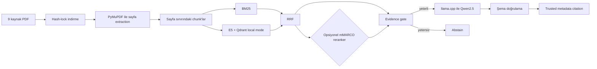

# Turkish Local RAG Benchmark

Türkçe · [English](README.md)

Bu proje, dokuz gerçek Sabancı Üniversitesi yönetmelik PDF'i üzerinde çalışan, yeniden üretilebilir ve CPU-only bir retrieval-augmented generation benchmark'ıdır. Sayfa duyarlı extraction, BM25, multilingual E5, reciprocal-rank fusion (RRF), isteğe bağlı cross-encoder reranking, deterministik evidence gate, yerel Qwen2.5 generation ve yalnızca trusted corpus metadata'sından oluşturulan citation katmanlarını bir araya getiriyor.

Amacım küçük ama baştan sona ölçülebilir bir araştırma/portföy projesi oluşturmaktı. Bu nedenle proje; hukuki, akademik, öğrenci işleri veya üniversite politikaları için bir danışmanlık sistemi olarak düşünülmemeli. Kaynak belgeler zamanla değişebilir ya da kaldırılabilir, üretilen cevaplar da eksik veya hatalı olabilir. Güncel resmî belgeyi ayrıca kontrol etmek gerekir.

## Mimari



Hedef sistem Windows, Intel i5-12450H, 8 GB RAM ve yalnızca CPU kullanan bir ortam. CUDA, ücretli API, cloud LLM, Docker veya ayrı bir Qdrant server gerekmiyor.

## Repository'de tutulanlar

- `data/manifest.json`: Kaynak kimlikleri, başlıklar, kaynak sayfalar ve PDF URL'leri
- `data/corpus.lock.json`: Dokuz PDF'in doğrulanmış final URL'si, UTC indirme zamanı, tam byte boyutu ve SHA-256 değeri
- Kod, config, networksüz testler, silver evaluation verisi, provenance bilgileri ve raporlar

PDF'ler üçüncü taraf kaynak dosyalar olduğu ve zamanla güncellenip kaldırılabildiği için repoya commit edilmiyor. PDF byte'ları ve yerel metadata `data/pdfs/` ile `data/downloads/` altında ignore ediliyor. Modeller, runtime binary'leri, extraction/chunk artifact'ları, Qdrant indexi ve cache'ler de aynı şekilde repo dışında kalıyor. Lock manifesti sayesinde PDF'leri yeniden dağıtmadan corpus kimliğini sabit tutmak mümkün oluyor.

## Kurulum

Python 3.12 veya daha yeni bir sürüm gerekiyor.

```powershell
git clone <repository-url>
cd turkish-local-rag-benchmark

python -m venv .venv
.\.venv\Scripts\python.exe -m pip install --upgrade pip
.\.venv\Scripts\python.exe -m pip install -e ".[dev]"
.\.venv\Scripts\python.exe -m pytest -q
```

Bağımlılıkların kurulması için internet bağlantısı gerekiyor. Unit testler fixture ve mock kullandığından PDF ya da model indirmiyor ve network çağrısı yapmıyor.

## Corpus ve indexi yeniden üretme

Önce dokuz PDF'i indirip repodaki lock dosyasıyla birebir doğrulayın:

```powershell
.\.venv\Scripts\python.exe -m turkish_local_rag.download --config config\default.toml
.\.venv\Scripts\python.exe -m turkish_local_rag.corpus_lock --config config\default.toml --verify
```

Downloader, içeriği önce geçici bir dosyaya stream ediyor. HTTP, PDF imza/trailer, boyut ve hash kontrolleri tamamlandıktan sonra dosyayı atomik olarak taşıyor. Var olan farklı bir dosya veya lock'takinden farklı bir uzak içerik sessizce ezilmiyor. Resmî kaynak gerçekten değiştiyse bunu yeni bir corpus sürümü olarak incelemek gerekiyor; lock dosyası otomatik güncellenmiyor.

Extraction ve chunking adımları:

```powershell
.\.venv\Scripts\python.exe -m turkish_local_rag.extract --config config\default.toml
.\.venv\Scripts\python.exe -m turkish_local_rag.chunk --config config\default.toml
```

Gerçek checkpoint'te 69 fiziksel PDF sayfası, 68 extracted text-page satırı ve 436 chunk bulunuyor. Hiçbir chunk fiziksel sayfa sınırını aşmıyor. Raw metin de normalize edilmiş metnin yanında korunuyor.

Corpus'a özgü `ılgili` → `İlgili` düzeltmesi yalnızca kanıtlanmış yedi tam sözcük konumuna uygulanıyor; genel bir noktasız `ı` dönüşümü değil. Gerçek E5 token sayıları min/ortalama/max olarak 18 / 139,81 / 289. Yani 512 token sınırını aşan chunk bulunmuyor.

Sabit embedding ve reranker asset'lerini indirip local indexi oluşturmak için:

```powershell
.\.venv\Scripts\python.exe -m turkish_local_rag.index --config config\default.toml --download-model-only
.\.venv\Scripts\python.exe -m turkish_local_rag.index --config config\default.toml --download-reranker-only
.\.venv\Scripts\python.exe -m turkish_local_rag.index --config config\default.toml
```

Var olan collection yalnızca açıkça `--rebuild` verildiğinde değiştiriliyor. Checkpoint; 436 normalize edilmiş 384 boyutlu vektör, mantıksal `ed36a52e3d0d39d2aee348e4d19c4834a25b6a023b367ce2a8bcd9f9a0c44566` fingerprint'i ve 2.495.132 byte disk boyutu taşıyor. Ölçülen rebuild süresi 40,43 saniye, peak process working set ise yaklaşık 926 MiB.

## Yerel generator kurulumu ve doğrulama

Projede tek bir generator kullanılıyor:

- Repository: `Qwen/Qwen2.5-1.5B-Instruct-GGUF`
- Revision: `91cad51170dc346986eccefdc2dd33a9da36ead9`
- Dosya/quantization: `qwen2.5-1.5b-instruct-q4_k_m.gguf`, `Q4_K_M`
- Boyut: 1.117.320.736 byte
- SHA-256: `6a1a2eb6d15622bf3c96857206351ba97e1af16c30d7a74ee38970e434e9407e`
- Lisans: Apache-2.0

Runtime olarak `llama.cpp` b10621 (`0.3.0-dev`, commit `c1d0e7a00`) Windows CPU x64 kullanılıyor. Arşiv boyutu 18.068.018 byte, SHA-256 değeri ise `0e8b65e650e369f70f8307d890508886f171ef4fb00facccddd4a1b7ffdaca51`.

```powershell
# Var olan asset'leri internet kullanmadan tam boyut/hash ile doğrular
.\.venv\Scripts\python.exe -m turkish_local_rag.setup_generation --config config\default.toml --verify

# Temiz clone'da yalnızca sabit ~1,12 GB GGUF ve ~18 MB runtime indirilir
.\.venv\Scripts\python.exe -m turkish_local_rag.setup_generation --config config\default.toml --download
```

Kurulum aracı HTTPS redirect hostunu, tam dosya boyutunu ve SHA-256 değerini doğruluyor. İndirme sırasında geçici dosya ve atomik taşıma kullanıyor; doğrulanmış mevcut asset'i atlıyor, uyuşmayan dosyayı ise ezmiyor.

Generator kalıcı bir `llama-server`, 2.560 token context, en fazla 160 output token, seed 42, temperature 0 ve dört CPU thread kullanıyor. Daha ayrıntılı bilgi [generator protocol lock](docs/generator_protocol.md) dosyasında bulunuyor.

## Sorgu

`hybrid_rrf` hızlı varsayılan pipeline. `hybrid_reranked` ise isteğe bağlı karşılaştırma modu:

```powershell
.\.venv\Scripts\python.exe -m turkish_local_rag.query --question "Sabancı Üniversitesinin en yüksek karar organı hangisidir?" --pipeline hybrid_rrf

.\.venv\Scripts\python.exe -m turkish_local_rag.query --question "Sabancı Üniversitesinin en yüksek karar organı hangisidir?" --pipeline hybrid_reranked
```

Evidence gate, yeterli kanıt yoksa model çağrısından önce abstain edebiliyor. Model çıktısı parse ve şema doğrulamasından geçiyor; geçersiz çıktı durumunda sistem fail-closed davranıyor.

Citation bilgisi modelin yazdığı metinden alınmıyor. Retrieved `document_id`, başlık, fiziksel sayfa, kaynak URL, PDF URL ve `chunk_id` metadata'sından oluşturuluyor. Başarılı cevaplar ve abstain sonuçları ortak versioned JSON schema 1.1'i kullanıyor; retrieval, reranking, generation ve total latency değerleri ayrı alanlarda tutuluyor.

## Evaluation yöntemi ve provenance

Benchmark, AI destekli bir silver evaluation seti kullanmaktadır. Veri setinin yayımlanmasına ve benchmarkta kullanılmasına, otomatik grounding kontrolleri ve 50 kaydın 20’si üzerinde yapılan insan audit’i sonrasında proje sahibi tarafından onay verilmiştir. Kayıtların tamamı tek tek insan incelemesinden geçmemiştir ve veri seti human-reviewed gold set olarak sunulmamaktadır.

```text
kind=silver
creation_method=ai_assisted
dataset_release_approved=true
approved_by=berksankir
approval_scope=dataset_level_with_sample_audit
all_records_human_reviewed=false
audit=20/50 (20 approved)
final_gold=false
```

Eski `human_reviewed=false` alanı yalnızca 50 kaydın tamamının item-level olarak incelenmediği anlamına geliyor; dataset-level yayımlama onayını geçersiz kılmıyor. Gerçek 20 item-level karar `evaluation/silver_audit.csv` dosyasında bulunuyor. Kalan 30 kayıt için reviewer veya timestamp üretilmedi. Model, prompt, pipeline ve threshold seçiminde test split kullanılmadı. LLM-as-a-judge da kullanılmıyor.

```powershell
.\.venv\Scripts\python.exe -m turkish_local_rag.review --config config\default.toml validate-silver-audit
.\.venv\Scripts\python.exe -m turkish_local_rag.evaluate --config config\default.toml --dataset silver
.\.venv\Scripts\python.exe -m turkish_local_rag.evaluate_generation --config config\default.toml
```

Var olan raporlar açıkça `--overwrite` verilmeden değiştirilmiyor. Orijinal Faz 8 generation koşusu `evaluation/results/silver/phase8_baseline/` altında korunuyor.

## Gerçek benchmark sonuçları

Retrieval-only sonuçları, 40 answerable kayıt:

| Pipeline | R@1 | R@3 | R@5 | MRR | Document@1 | Page@1 | Ortalama latency |
|---|---:|---:|---:|---:|---:|---:|---:|
| Dense | 0,550 | 0,875 | 0,925 | 0,714 | 0,800 | 0,550 | 86,8 ms |
| BM25 | 0,675 | 0,900 | 0,950 | 0,799 | 0,875 | 0,675 | 3,2 ms |
| Hybrid RRF | 0,725 | 0,925 | 0,950 | 0,833 | 0,900 | 0,725 | 88,8 ms |
| Hybrid reranked | 0,775 | 0,950 | 1,000 | 0,868 | 0,925 | 0,775 | 4.467,5 ms |

Grounded generation sonuçları, 50 kayıt:

| Pipeline | Citation accuracy | Answerable coverage | Correct abstention | False abstention | Token F1 | Key facts |
|---|---:|---:|---:|---:|---:|---:|
| Hybrid RRF | 0,676 | 0,925 | 0,700 | 0,075 | 0,420 | 0,390 |
| Hybrid reranked | 0,686 | 0,875 | 0,500 | 0,125 | 0,406 | 0,397 |

| Pipeline | Retrieval ort./p95 | Reranking ort./p95 | Generation ort./p95 | Total ort./p95 |
|---|---:|---:|---:|---:|
| Hybrid RRF | 60,5 / 99,8 ms | 0 / 0 ms | 15,26 / 30,12 sn | 15,33 / 30,18 sn |
| Hybrid reranked | 50,7 / 67,8 ms | 1,59 / 2,20 sn | 6,33 / 17,88 sn | 8,14 / 19,70 sn |

Pipeline'lar art arda çalıştığı için generation latency farkı, response uzunluğunu ve cache ısısını da yansıtıyor. Yani bu fark reranker'ın doğrudan hızlandırma sağladığı anlamına gelmiyor.

Gerçek Faz 10 koşusu 1.173,2 saniye sürdü. Peak process-tree RSS yaklaşık 2.928.771.072 byte (2,73 GiB) ölçüldü. On çıktı fail-closed oldu: yedisinde invalid JSON syntax, üçünde invalid context ID vardı. Kalite metrikleri Faz 8 baseline'a göre değişmedi. Ayrıntılar [final error analysis](docs/error_analysis.md) dosyasında.

## Gerçek örnekler

Başarılı RRF sorgusu (`candidate-001`):

```json
{
  "question": "Sabancı Üniversitesinin en yüksek karar organı hangisidir?",
  "answer": "Mütevelli Heyet",
  "abstained": false,
  "citation": {
    "document_id": "sabanci-ana-yonetmeligi",
    "physical_page": 2,
    "chunk_id": "sabanci-ana-yonetmeligi:p2:c5"
  }
}
```

Doğru abstention (`candidate-041`): “Sabancı Üniversitesi kampüs yemekhanesinin 7 Eylül 2026 Pazartesi günü öğle menüsü nedir?” sorusu, `query_coverage_below_threshold` nedeniyle model çağrılmadan “Yeterli kanıt bulunamadı.” sonucu ve boş citation listesi üretti.

Gerçek başarısızlık (`candidate-004`, RRF): Kanıt generator'a ulaştı fakat model, izin verilen iki denemede de untrusted context ID seçti. Yanıt `generator_invalid_context_id` ile fail-closed oldu ve citation üretilmedi.

## Bileşen sürümleri ve lisanslar

| Bileşen | Sabit sürüm/revision | Upstream lisans |
|---|---|---|
| Bu repository | 0.1.0 | [MIT](LICENSE) |
| Qwen2.5 generator | `91cad511…`, Q4_K_M | [Apache-2.0](https://huggingface.co/Qwen/Qwen2.5-1.5B-Instruct-GGUF/blob/main/LICENSE) |
| llama.cpp | b10621 / commit `c1d0e7a00` | [MIT](https://github.com/ggml-org/llama.cpp/blob/b10621/LICENSE) |
| multilingual-e5-small | `614241f6…` | [MIT](https://huggingface.co/intfloat/multilingual-e5-small/tree/614241f622f53c4eeff9890bdc4f31cfecc418b3) |
| mMARCO reranker | `1427fd65…` | [Apache-2.0](https://huggingface.co/cross-encoder/mmarco-mMiniLMv2-L12-H384-v1) |
| Qdrant client | 1.19.0 | [Apache-2.0](https://github.com/qdrant/qdrant-client/blob/master/LICENSE) |
| Sentence Transformers | 6.0.1 | [Apache-2.0](https://github.com/huggingface/sentence-transformers/blob/master/LICENSE) |
| PyMuPDF | 1.28.2 | [AGPL-3.0 veya ticari Artifex lisansı](https://pymupdf.readthedocs.io/en/latest/about.html#license-and-copyright) |
| rank-bm25 | 0.2.2 | [Apache-2.0](https://github.com/dorianbrown/rank_bm25/blob/master/LICENSE) |

Bu tablo yalnızca bilgi amaçlı; hukuki tavsiye veya uyumluluk garantisi değil. Dağıtım yapılacaksa PyMuPDF'nin AGPL yükümlülükleri ya da ticari lisans koşulları ayrıca değerlendirilmeli. Transitif bağımlılıkların da kendi lisansları bulunuyor.

Bu repository'nin kaynak kodu [MIT Lisansı](LICENSE) altında yayımlanıyor. Proje lisansı, üçüncü taraf lisans yükümlülüklerinin yerine geçmiyor veya onları geçersiz kılmıyor.

## Bilinen sınırlamalar

- Dokuz PDF ve 50 silver soru, geniş genelleme yapmak için küçük bir veri seti.
- Yalnızca 20/50 kayıt item-level insan audit'inden geçti.
- Resmî URL'ler ve içerikler değişebilir veya kaldırılabilir. Lock bu değişimi algılar ama upstream erişilebilirliğini koruyamaz.
- PyMuPDF text-layer extraction OCR değil; bir fiziksel sayfanın text layer'ı boş.
- Reranker bu projede Türkçe için zero-shot kullanılıyor. Bazı retrieval metriklerini iyileştirirken abstention sonucunu kötüleştiriyor ve CPU latency ekliyor.
- Citation metadata trusted olsa da strict citation relevance yaklaşık %68.
- Token F1 (~0,42/0,41) ve key-fact coverage (~0,39/0,40) düşük.
- Generation koşularının %10'u schema/context validation nedeniyle abstain ediyor.
- CPU generation süresi model çağrısı başına birkaç saniyeden 30 saniyenin üzerine çıkabiliyor.
- Evidence threshold yalnızca küçük silver dev split'ten geliyor; test split tuning yapılmadı.

Ayrıntılı artifact'lar `evaluation/results/silver/`, tarihsel provisional sonuçlar ise `evaluation/provisional/` altında bulunuyor.
